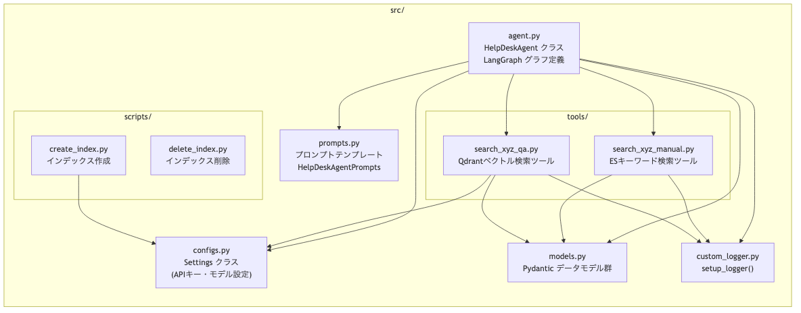
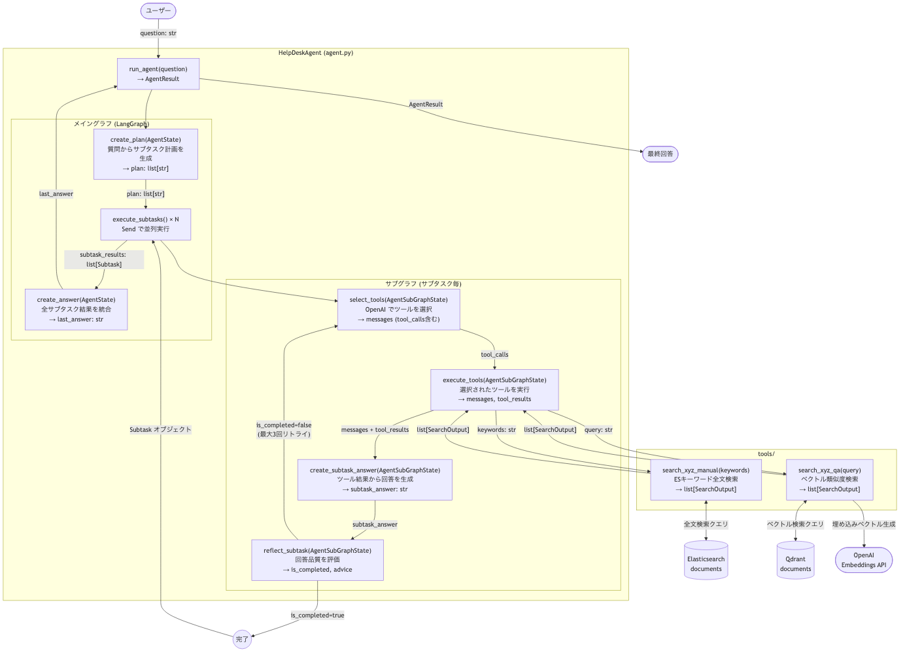
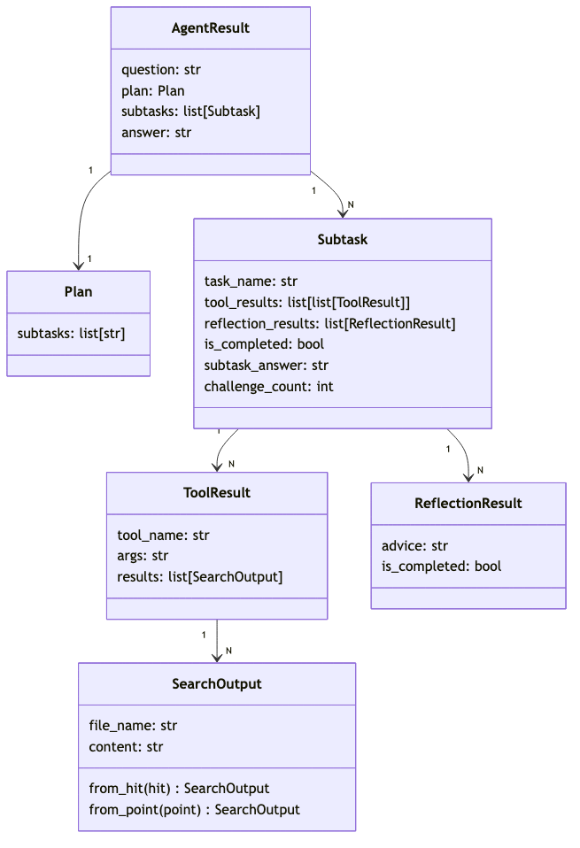

# Chapter4 アーキテクチャ図

## 図1: ファイル構成と依存関係

---

## 図2: エージェント実行フロー（関数の入出力）

---

## 図3: データモデルの関係（models.py）

---

## ファイル役割まとめ

| ファイル | 主な役割 |
|---|---|
| `agent.py` | エージェント本体。LangGraphで「計画→並列サブタスク実行→最終回答」の2層グラフを構築 |
| `models.py` | 全データの型定義。`AgentResult`がトップレベルで結果を集約 |
| `prompts.py` | 各ノード用のプロンプトテンプレートを一元管理 |
| `configs.py` | `.env`からAPIキーを読み込む設定クラス |
| `custom_logger.py` | 全ファイル共通のロガーを生成 |
| `tools/search_xyz_manual.py` | Elasticsearchで**キーワード全文検索**（マニュアルPDF向け） |
| `tools/search_xyz_qa.py` | Qdrantで**ベクトル意味検索**（QA CSV向け） |
| `scripts/create_index.py` | PDF/CSVをロードしてES/Qdrantにインデックス構築（初期セットアップ用） |
| `scripts/delete_index.py` | ES/Qdrantのインデックスを削除（リセット用） |
