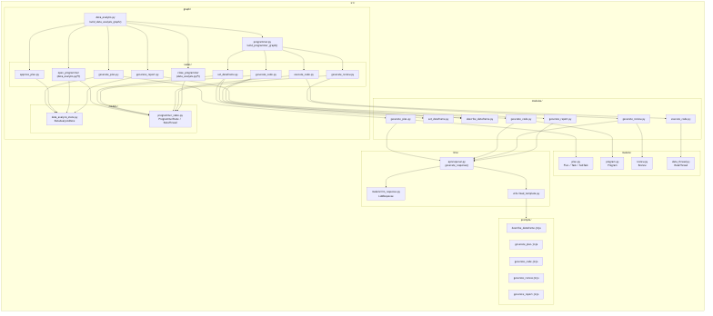
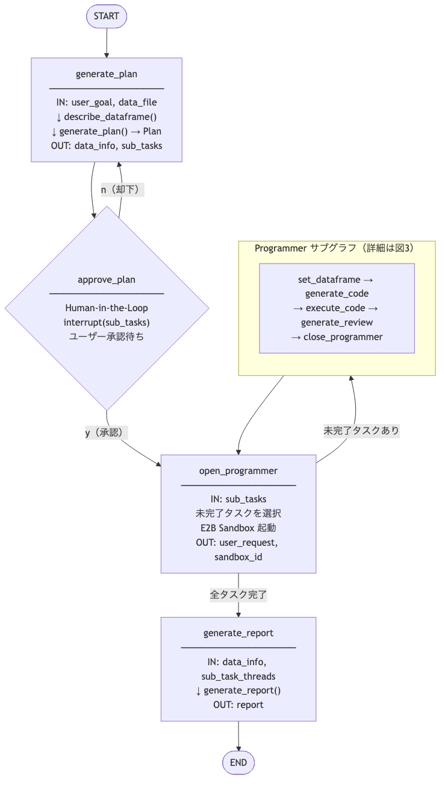
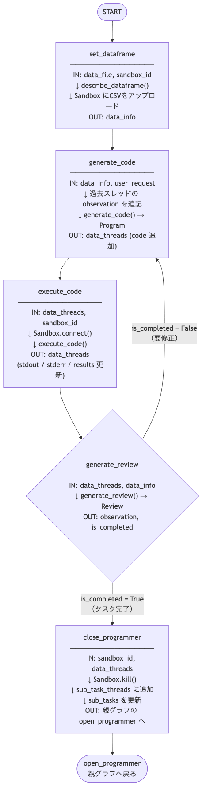

# Chapter5 アーキテクチャ図

## 図1: ファイル構成と依存関係



---

## 図2: データ分析グラフ実行フロー（外側グラフ）



---

## 図3: Programmer サブグラフ実行フロー（内側グラフ）



---

## ファイル役割まとめ

| ファイル | 主な役割 |
|---|---|
| `src/graph/data_analysis.py` | 外側グラフ。計画生成→ユーザー承認→サブタスク並列実行→レポート生成の全体フローを制御 |
| `src/graph/programmer.py` | 内側グラフ（サブグラフ）。コード生成→実行→レビューのループを管理 |
| `src/graph/nodes/generate_plan.py` | CSVを解析してサブタスク計画を生成するノード |
| `src/graph/nodes/approve_plan.py` | Human-in-the-Loop でユーザーに計画の承認を求めるノード |
| `src/graph/nodes/set_dataframe.py` | E2B Sandbox にCSVをアップロードしデータ情報を取得するノード |
| `src/graph/nodes/generate_code.py` | データ情報とリクエストをもとにPythonコードを生成するノード |
| `src/graph/nodes/execute_code.py` | E2B Sandbox 上でコードを実行するノード |
| `src/graph/nodes/generate_review.py` | 実行結果をレビューし完了判定・フィードバックを行うノード |
| `src/graph/nodes/generate_report.py` | 全サブタスクの結果をまとめて最終レポートを生成するノード |
| `src/graph/models/data_analysis_state.py` | 外側グラフの状態定義（`DataAnalysisState`） |
| `src/graph/models/programmer_state.py` | 内側グラフの状態定義（`ProgrammerState` / `DataThread`） |
| `src/modules/` | ノードから呼ばれるビジネスロジック（LLM呼び出し・コード実行等） |
| `src/models/plan.py` | 計画のデータモデル（`Plan` / `Task` / `SubTask`） |
| `src/models/program.py` | 生成コードのデータモデル（`Program`） |
| `src/models/review.py` | レビュー結果のデータモデル（`Review`） |
| `src/models/data_thread.py` | コード実行スレッドのデータモデル（`DataThread`） |
| `src/llms/apis/openai.py` | OpenAI APIラッパー。Structured Outputs / Chat Completion を抽象化 |
| `src/llms/models/llm_response.py` | LLMレスポンスの統一モデル（トークン数・コスト計算含む） |
| `src/prompts/` | Jinja2 形式のプロンプトテンプレート群 |

## グラフ構成の概要

chapter5 は **2層グラフ構造** を採用しています。

```
DataAnalysis グラフ（外側）
├── generate_plan       : CSVを読み込み、分析サブタスクを計画
├── approve_plan        : ユーザーが計画を承認 or 却下
├── open_programmer     : 未完了サブタスクを選択し Sandbox を起動
├── programmer          : ← Programmer サブグラフ（内側）
│   ├── set_dataframe   : Sandbox にCSVをロード
│   ├── generate_code   : 分析コードを生成
│   ├── execute_code    : Sandbox でコードを実行
│   ├── generate_review : 実行結果をレビュー（完了 or 再生成）
│   └── close_programmer: Sandbox を終了し親グラフへ戻る
└── generate_report     : 全サブタスク結果からレポートを生成
```
