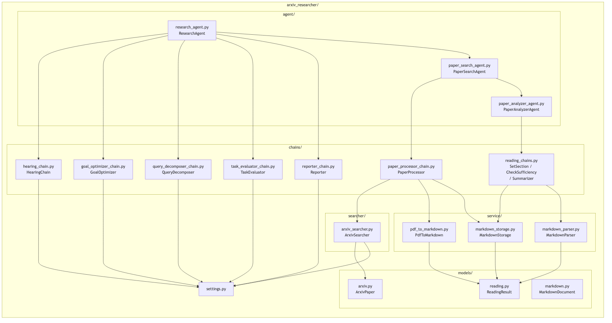
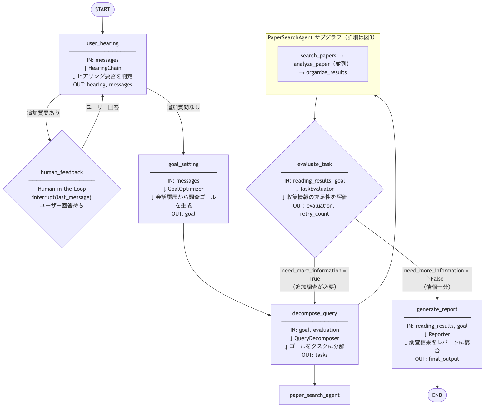
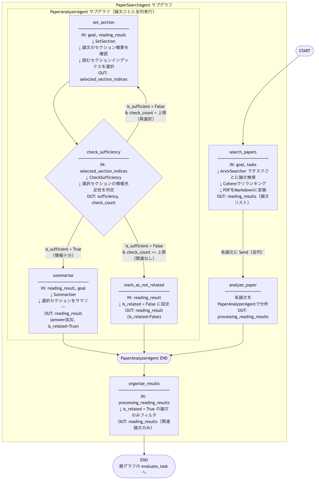

# Chapter6 アーキテクチャ図

## 図1: ファイル構成と依存関係



---

## 図2: ResearchAgent 実行フロー（外側グラフ）



---

## 図3: PaperSearchAgent / PaperAnalyzerAgent サブグラフ実行フロー



---

## ファイル役割まとめ

| ファイル | 主な役割 |
|---|---|
| `arxiv_researcher/agent/research_agent.py` | 外側グラフ。ヒアリング→ゴール設定→タスク分解→論文検索→評価→レポート生成の全体フローを制御 |
| `arxiv_researcher/agent/paper_search_agent.py` | 中間サブグラフ。論文の収集・変換・並列分析・フィルタリングを担当 |
| `arxiv_researcher/agent/paper_analyzer_agent.py` | 内側サブグラフ。個別論文のセクション選択→充足性チェック→サマリー生成のループを管理 |
| `arxiv_researcher/chains/hearing_chain.py` | 会話履歴を分析し、追加ヒアリングの要否と質問内容を生成 |
| `arxiv_researcher/chains/goal_optimizer_chain.py` | 会話履歴から具体的な調査ゴールを生成・最適化 |
| `arxiv_researcher/chains/query_decomposer_chain.py` | 調査ゴールをarXiv検索用のサブタスクに分解 |
| `arxiv_researcher/chains/paper_processor_chain.py` | タスクごとに論文を検索し、PDF→Markdown変換を行い、論文ごとに並列分析を指示 |
| `arxiv_researcher/chains/reading_chains.py` | `SetSection`: 読むセクション選択 / `CheckSufficiency`: 情報充足性判定 / `Summarizer`: セクションサマリー生成 |
| `arxiv_researcher/chains/task_evaluator_chain.py` | 収集した論文情報の充足性を評価し、追加調査の要否を判定 |
| `arxiv_researcher/chains/reporter_chain.py` | 全論文の分析結果を統合して最終レポートを生成 |
| `arxiv_researcher/searcher/arxiv_searcher.py` | arXiv APIへのクエリ生成・検索・Cohereによるリランキングを担当 |
| `arxiv_researcher/service/pdf_to_markdown.py` | Jina Reader APIを使いPDFをMarkdown形式に変換 |
| `arxiv_researcher/service/markdown_storage.py` | Markdown論文ファイルの読み書きを管理 |
| `arxiv_researcher/service/markdown_parser.py` | Markdownのセクション構造を解析して選択セクションを抽出 |
| `arxiv_researcher/models/arxiv.py` | arXiv論文のデータモデル（`ArxivPaper`） |
| `arxiv_researcher/models/reading.py` | 論文読解結果のデータモデル（`ReadingResult`） |
| `arxiv_researcher/settings.py` | APIキー・LLMモデル・各種上限値などの設定 |
| `arxiv_researcher/chains/prompts/` | 各チェーンが使用するプロンプトテンプレート群 |

## グラフ構成の概要

chapter6 は **3層グラフ構造** を採用しています。

```
ResearchAgent グラフ（外側）
├── user_hearing        : ヒアリング要否を判定し、追加質問を生成
├── human_feedback      : Human-in-the-Loop でユーザーの追加回答を待機
├── goal_setting        : 会話履歴から調査ゴールを生成（GoalOptimizer）
├── decompose_query     : ゴールをサブタスクに分解（QueryDecomposer）
├── paper_search_agent  : ← PaperSearchAgent サブグラフ（中間）
│   ├── search_papers   : arXivから論文を検索・PDF変換（PaperProcessor）
│   ├── analyze_paper   : ← PaperAnalyzerAgent サブグラフ（内側・並列）
│   │   ├── set_section         : 読むセクションのインデックスを選択
│   │   ├── check_sufficiency   : 選択セクションの情報充足性を判定
│   │   ├── summarize           : 充足していればセクションをサマリー
│   │   └── mark_as_not_related : 上限まで不足なら非関連としてマーク
│   └── organize_results: 関連論文のみをフィルタリング
├── evaluate_task       : 収集情報の充足性を評価（TaskEvaluator）
└── generate_report     : 全結果から最終レポートを生成（Reporter）
```
